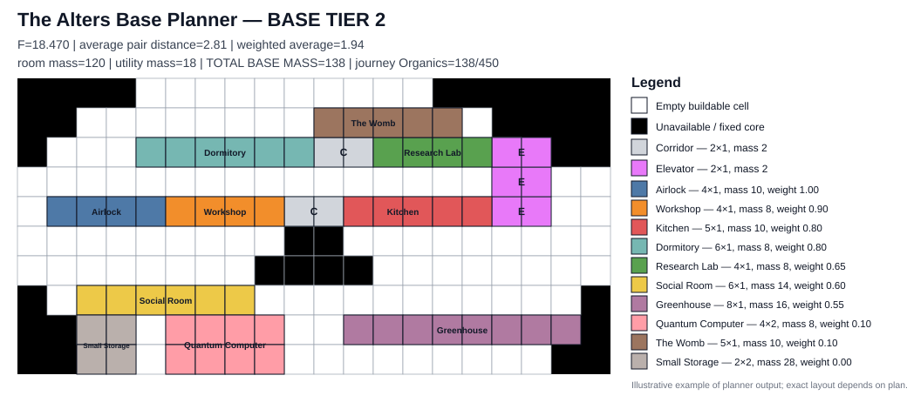

# The Alters Base Planner

Optimization-based planner for the mobile base in **The Alters**.

The player selects the base tier and requested room counts in `config/plan.json`. Corridors and Elevators are solver-controlled and are added automatically.

## Model

The planner has two layers:

1. **hard constraints** — all requested/mandatory modules must fit the selected Base tier, avoid the immovable core and overlaps, use legal connections and belong to one walkable network rooted at the Airlock;
2. **one soft objective** — minimize the weighted sum of pairwise room distances.

The normative model is in `docs/OPTIMIZATION_MODEL.md`.

## Editable Base I-IV geometry

The four built-in base shapes are stored as separate CSV files:

```text
src/alters_base_planner/data/base-size1.csv
src/alters_base_planner/data/base-size2.csv
src/alters_base_planner/data/base-size3.csv
src/alters_base_planner/data/base-size4.csv
```

CSV semantics:

```text
0 = outside usable base
1 = buildable cell
X = immovable blocked/core cell
```

Width and height are inferred from the CSV itself. The current masks remain provisional (`geometry_verified = false`) until calibrated against game-exact screenshots/assets.

## Objective function

Each room type has an accepted default gameplay traffic weight `w` in `src/alters_base_planner/data/usage_weights.json`.

| Module | Weight |
|---|---:|
| Airlock | 1.00 |
| Workshop | 0.90 |
| Kitchen | 0.80 |
| Dormitory | 0.80 |
| Captain's Cabin | 0.70 |
| Research Lab | 0.65 |
| Social Room | 0.60 |
| Greenhouse | 0.55 |
| Refinery | 0.55 |
| Command Center | 0.35 |
| Machinery | 0.35 |
| Communication Room | 0.25 |
| Infirmary | 0.25 |
| Contemplation Room | 0.25 |
| Personal Cabin | 0.25 |
| Gym | 0.20 |
| Gamer's Den | 0.20 |
| Park with Bench | 0.15 |
| Materializer | 0.10 |
| Quantum Computer | 0.10 |
| The Womb | 0.10 |
| Recycler / passive modules / Storage | 0.00 |

For every unordered pair of rooms with positive weight:

```text
pair_score(i,j) = w(i) * w(j) * d(i,j)
F = sum_{i<j} pair_score(i,j)
```

### Distance semantics

The two endpoint rooms being measured do **not** contribute their own width. Transit rooms do.

```text
direct endpoint-room adjacency = 0
one Corridor module            = +1
one Elevator module            = +1
intermediate transit room C    = +width(C) grid cells
start room                     = 0
destination room               = 0
```

Example:

```text
A(4x1) | C(6x1) | B(8x1)

d(A,C) = 0
d(C,B) = 0
d(A,B) = 6
```

Every individual Elevator is +1, so a four-module Elevator stack contributes 4 if all four modules are traversed.

## Hard constraints

The solver enforces or validates:

- exact requested room counts;
- mandatory story/core rooms automatically included;
- selected irregular Base I-IV CSV mask;
- no overlap with the fixed `X` obstruction;
- no room/module overlap;
- documented module orientation;
- legal left/right access ports and connection level;
- Corridors for horizontal utility connectivity;
- vertical connectivity only between immediately adjacent Elevator modules at the same `x`;
- one connected network rooted at Airlock;
- non-transit terminal modules cannot be used as bridges;
- all Corridors/Elevators belong to the access network;
- continuous Elevator coverage across every used floor.

For every adjacent floor pair `(y,y+1)`:

```text
ElevatorX[y] ∩ ElevatorX[y+1] != empty
```

## Base Mass and journey cost

Every feasible layout reports:

```text
room_mass
utility_mass
total_base_mass
organics_required_for_journey
organics_tank_capacity
capacity_margin
travel_feasible_at_full_tank
mass_breakdown
```

For the mobile base:

```text
organics_required_for_journey = total_base_mass
```

Corridor mass = 2. Elevator module mass = 2.

Mass is not part of primary `F`; for equal `F`, lower mass may be used as a tie-breaker.

Room size/mass evidence and known public-source conflicts are recorded in `docs/ROOM_DATA_AUDIT.md`.

## Example graphical result

The planner generates a color-coded diagram with the Base Tier, optimization score, average distances, module legend and journey mass.



The example above is illustrative; the actual result is generated from the selected `base-sizeN.csv` mask and `config/plan.json`.

PNG/SVG semantics:

- **black** — unavailable cells, outside the base and the fixed core;
- **white** — empty buildable cells;
- distinct colors — room types;
- grey — Corridor;
- magenta — Elevator.

The legend shows each room's **size, mass and usage weight**. The chart title reports Base Tier, `F`, arithmetic and weighted mean distance, room mass, utility mass, **TOTAL BASE MASS**, and journey Organics versus tank capacity.

## Player configuration

Edit `config/plan.json`:

```json
{
  "$schema": "./plan.schema.json",
  "base_tier": 2,
  "rooms": {
    "workshop": 1,
    "research_lab": 1,
    "dormitory": 1,
    "infirmary": 1,
    "greenhouse": 1,
    "refinery": 1,
    "small_storage": 2,
    "social_room": 1,
    "recycler": 1
  },
  "solver": {
    "objective": "weighted_pair_distance",
    "time_limit_s": 15,
    "max_layout_attempts": 30
  },
  "output": {
    "svg": "layout.svg",
    "png": "layout.png",
    "json": "layout.json"
  }
}
```

Mandatory rooms are added automatically. `corridor` and `elevator` are not valid player configuration keys.

## Run from a fresh clone

Python **3.11 or newer** is required.

### Windows PowerShell

Because this repository is private, clone it while authenticated to GitHub.

```powershell
git clone https://github.com/PeterPirog/alters-base-planner.git
cd alters-base-planner

py -3.12 -m venv .venv
.\.venv\Scripts\Activate.ps1

python -m pip install --upgrade pip
python -m pip install -e ".[dev]"
```

Edit `config/plan.json`, then run the calculation:

```powershell
python -m alters_base_planner.cli config/plan.json
```

Equivalent installed CLI command:

```powershell
alters-base-planner config/plan.json
```

Successful calculation writes the paths configured in `config/plan.json`, normally:

```text
layout.png   # graphical plan
layout.svg   # vector graphical plan
layout.json  # full machine-readable result and audit metrics
```

Open the generated PNG directly from PowerShell:

```powershell
Start-Process .\layout.png
```

### Linux / macOS

```bash
git clone https://github.com/PeterPirog/alters-base-planner.git
cd alters-base-planner
python3 -m venv .venv
source .venv/bin/activate
python -m pip install --upgrade pip
python -m pip install -e '.[dev]'
python -m alters_base_planner.cli config/plan.json
```

## Streamlit UI

The JSON configuration remains the source of room counts. The optional Streamlit interface runs the same solver and displays/downloads the generated diagram:

```bash
python -m streamlit run app.py
```

## Result JSON

The JSON output persists the objective, arithmetic mean distance, weighted mean distance, all pairwise distances/contributions, room usage weights, utility counts, geometry provenance, module masses and journey feasibility.

## Optimization engine status

The current implementation:

1. reads selected Base geometry from CSV;
2. enumerates legal room placements with OR-Tools CP-SAT;
3. constructs legal Corridor/Elevator routing;
4. validates connectivity and continuous vertical Elevator coverage;
5. computes shortest paths with intermediate-room traversal costs;
6. evaluates `F` exactly for every connected candidate generated;
7. retains the smallest examined `F`;
8. persists Base Mass and journey metrics;
9. renders PNG/SVG output.

The current placement + post-router architecture does **not yet prove** global optimality across the full joint room + Corridor + Elevator search space, so:

```text
global_objective_optimum_proven = false
```

## Development

```bash
ruff check .
pytest -q
```

## License / trademarks

This is an unofficial fan tool. *The Alters* and related trademarks belong to their respective owners.
